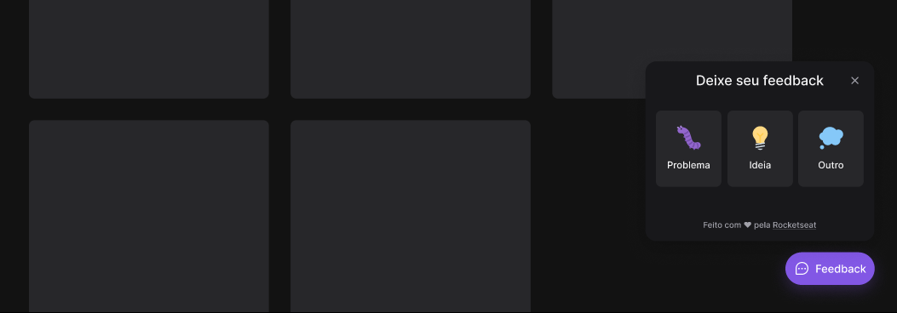

<h1 align="center">FeedGet Server</h1>

 

<!-- Image that represents what the project does -->
| | 
| :---: |

## Index
  1. [Project Description](#description)
  2. [Techniques and Technologies](#technologies)
  3. [Open and run the project](#run_project)
  4. [Project Features](#project_features)
  4. [People who helped develop the project](#developers)
  5. [Portuguese Readme](./README.md)

### Project Description
###### description
This is the server of a project that was meant to be something "Simple", but that helps me to study reactJS, reactNative (I'm going to make the mobile version) and nodeJS - caring about accessibility. The project's goal is to be a widget where the user can send feedback, be it a bug, an improvement idea or any other feedback that doesn't fit in these other two categories, besides that, the user will have the option to insert a screenshot, but this one won't have to take a print, since by clicking the button the print is done automatically and applied in the feedback. When sending this feedback, it is entered into a database and emailed to the developers.

### Techniques and Technologies
###### technologies
- Typescript
- Express
- SQLite (Ambiente DEV)
- Postgresql (Ambiente de produção)
- Prisma
- Jest

## 🛠️ Open and run the server
###### run_project
#### 1- Clone the Project
#### 2- Install all dependencies
   `npm install`
#### 3- Launch Prisma
   `npx prisma init`

#### 4- In the schema.prisma file copy and paste this:
```
   generator client {
      provider = "prisma-client-js"
   }

   datasource db {
    provider = "sqlite"
    url      = env("DATABASE_URL")
   }

   model Feedback {
      id String @id @default(uuid())

      type       String
      comment    String
      screenshot String?

      @@map("feedbacks")
   }
   ```
#### 5- Create the migrations in the dev or production environment with:
 ```
 //if it is a dev environment
 
 npx prisma migrate dev

 //if it is a production environment

 npx prisma migrate deploy
 ```
#### 6- Run the server 
   `npm run dev`

#### 7- Non-required step (if you want to see your database without having to install anything type this command in the console)
   `npx prisma studio`
   
 
### 🔨 Project Features
###### project_features
- `Hover`: When you hover the mouse over the widget a color transition will occur and text will appear that reads 'feedback'
- `Category Choice`: You can choose the category of the feedback by clicking on the widget
- `Auto Print`: By clicking the button (after selecting the category) an automatic print of the screen is taken and inserted into the feedback

## Project Developer
###### developers
| [<br><sub>Carolina Teixeira Coelho</sub>](https://github.com/caroolt) | 
| :---: |


